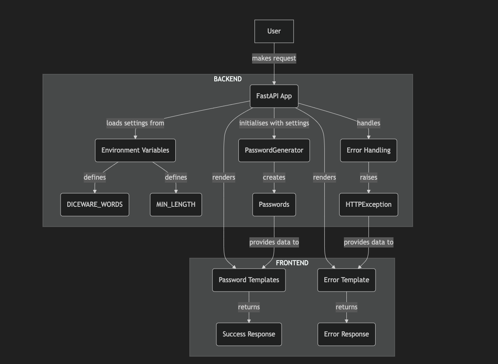

# Password Please

## Overview

**Password Please** (`pwplz`) is a simple web application that generates and manages passwords using [FastAPI](https://fastapi.tiangolo.com/tutorial/). With a user-friendly interface, users can generate, view, and copy passwords easily.

## Application Logic

### Features

`pwplz` offers the following features:

-   **Password Generation**: Automatically generates a set of passwords using defined rules.
-   **Simple Interface**: A simple web interface that displays generated passwords along with options to copy them to the clipboard.
-   **Easy Regeneration**: Users can regenerate passwords dynamically without refreshing the page.

## Application Structure

The application consists of the following key components:

-   `app.py`: This file contains the main FastAPI application logic. It sets up the routing, static file handling, and the password generation logic using the PasswordGenerator class.
-   `main.py`: This file serves as the entry point for running the application with Uvicorn. It specifies the host and port for the server.
-   `templates/index.html`: The HTML template that renders the user interface. It uses Jinja2 for templating and displays the generated passwords in a user-friendly format.
-   `static/styles.css`: The CSS file that styles the application for a better user experience.
-   `static/js/script.js`: The JavaScript file that handles clipboard copying functionality.

### How It Works

-   **Startup**: When the application starts, it initialises the FastAPI app, mounts the static files directory, and creates an instance of the PasswordGenerator class.

-   **Password Generation**: Upon accessing the root endpoint (/), the application generates a set of passwords and renders them in the index.html template.

-   **User Interaction**: Users can view the generated passwords and click the "Copy" button to copy a password to their clipboard. The "Regenerate" button allows users to generate a new set of passwords without reloading the page.

## Architecture



## Installation

To run this application locally, follow these steps:

### Clone the Repository

```bash
git clone https://github.com/devArno88/pwplz.git
cd pwplz
```

### Create a Virtual Environment

_Optional but recommended_

```bash
python -m venv venv
source venv/bin/activate # On Windows use `venv\Scripts\activate`
```

### Install Dependencies

```bash
pip install -r requirements.txt
```

### Configuration

The `PasswordGenerator` is a straightforward yet versatile class with various methods for generating different types of passwords. This class is initialised with keyword arguments that must include:

-   `min_length`: the minimum password length required, where applicable
-   `words`: a hyphen-joined list of words for Diceware passwords.

These can (and should) be configured separately within a .env file, like so:

```bash
# .env

MIN_LENGTH=50
DICEWARE_WORDS=kiwi-apple-orange-banana-watermelon #etc
```

`pwplz` integrates analytics through [Apitally.io](https://apitally.io/), with the integration configured via the ApitallyMiddleware in FastAPI. The APITALLY_ID is securely stored in the .env file, allowing each developer to use their own account or remove the middleware entirely for customised setup.

### Run the Application

```bash
python3 main.py
```

### Access the Application

Open a web browser (Chrome, Safari, Firefox etc.) and navigate to http://localhost:8000.

## Hosting

This app is hosted on [Vercel](https://vercel.com/), with a dedicated Vercel domain ([pwplz.vercel.app](https://pwplz.vercel.app)) pointing to a custom domain ([pwplz.com](https://pwplz.com)), but can also be deployed and hosted on any FastAPI-compatible cloud service, such as [Render](https://render.com/) or [Railway](https://railway.app/).

### Motivation

I was eager to craft a project that highlights just how amazing Python can be, and FastAPI's approachable nature made it all come together effortlessly. Within minutes, you can easily craft a sleek HTML frontend that syncs seamlessly with an ultra-responsive backend.

## Contributing

Contributions to `pwplz` are most welcome, and I'm excited to see this project grow with your ideas and improvements. Please take a moment to review the [CONTRIBUTING](./CONTRIBUTING.md) file before you start. It outlines the steps to get involved, including how to fork the repository, create branches, test, and submit pull requests.

We also believe in fostering a positive, inclusive community. Our [CODE_OF_CONDUCT](./CODE_OF_CONDUCT.md) sets expectations for respectful interactions and outlines steps to report unacceptable behavior. By contributing to this project, you agree to abide by this code.

## License

This project is licensed under the MIT License. See the [LICENSE](./LICENSE) file for details.
