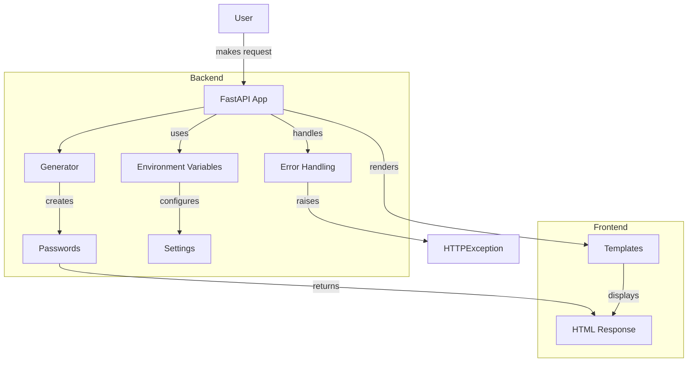

# Password Please

## Overview

_Password Please_ (`pwplz`) is a simple web application that generates and manages passwords using [FastAPI](https://fastapi.tiangolo.com/tutorial/). With a user-friendly interface, users can generate, view, and copy passwords easily.

### Motivation

I wanted to create a project that showcases the beauty of Python, and FastAPI makes it easier than ever to do just that. Like Flask, it lets you tweak response types, which means you can whip up a simple HTML frontend that works perfectly with a lightning-fast backend. This application demonstrates the power and flexibility of FastAPI in building web applications quickly and efficiently.

### FastAPI

[FastAPI](<(https://fastapi.tiangolo.com/tutorial/)>) is a modern, high-performance web framework for building APIs with Python 3.6+ based on standard Python type hints. FastAPI is designed to be fast and efficient, making it suitable for building both simple and complex applications. It provides the following key features:

-   **Fast**: Very high performance, on par with NodeJS and Go, thanks to Starlette and Pydantic.
-   **Easy**: Designed to be easy to use and learn, with intuitive code and automatic generation of documentation.
-   **Built-in Validation**: Automatically validates request data against defined models.
-   **Interactive Documentation**: Automatically generated API docs (Swagger UI and ReDoc).
-   **Asynchronous Support**: Full support for async and await, allowing for high concurrency.

## Application Logic

### Features

`pwplz` offers the following features:

Password Generation: Automatically generates a set of passwords using defined rules.
User Interface: A simple web interface that displays generated passwords along with options to copy them to the clipboard.
Dynamic Password Regeneration: Users can regenerate passwords dynamically without refreshing the page.

## Application Structure

The application consists of the following key components:

-   `app.py`: This file contains the main FastAPI application logic. It sets up the routing, static file handling, and the password generation logic using the PasswordGenerator class.
-   `main.py`: This file serves as the entry point for running the application with Uvicorn. It specifies the host and port for the server.
-   `templates/index.html`: The HTML template that renders the user interface. It uses Jinja2 for templating and displays the generated passwords in a user-friendly format.
-   `static/styles.css`: The CSS file that styles the application for a better user experience.
-   `static/js/script.js`: The JavaScript file that handles clipboard copying functionality.

### How It Works

-   **Startup**: When the application starts, it initializes the FastAPI app, mounts the static files directory, and creates an instance of the PasswordGenerator class.

-   **Password Generation**: Upon accessing the root endpoint (/), the application generates a set of passwords and renders them in the index.html template.

-   **User Interaction**: Users can view the generated passwords and click the "Copy" button to copy a password to their clipboard. The "Regenerate" button allows users to generate a new set of passwords without reloading the page.

## Architecture



## Installation

To run this application locally, follow these steps:

### Clone the Repository

```bash
git clone https://github.com/devArno88/pwplz.git
cd pwplz
```

### Create a Virtual Environment

_Optional but recommended_

```bash
python -m venv venv
source venv/bin/activate # On Windows use `venv\Scripts\activate`
```

### Install Dependencies

```bash
pip install -r requirements.txt
```

### Run the Application

```bash
python3 main.py
```

### Access the Application

Open a web browser (Chrome, Safari, Firefox etc.) and navigate to http://localhost:8000.

## Hosting

This app is hosted on [Vercel](https://vercel.com/), with a dedicated Vercel domain ([pwplz.vercel.app](https://pwplz.vercel.app)) pointing to a custom domain ([pwplz.com](https://pwplz.com)), but can also be deployed and hosted on any FastAPI-compatible cloud service, such as [Render](https://render.com/) or [Railway](https://railway.app/).

## Contributing

Contributions are welcome! If you have suggestions for improvements or want to add new features, please fork the repository and create a pull request.

-   Fork the repository.
-   Create your feature branch (`git checkout -b feature/AmazingFeature`).
-   Commit your changes (`git commit -m 'Add some amazing feature'`).
-   Push to the branch (`git push origin feature/AmazingFeature`).
-   Open a pull request.

## License

This project is licensed under the MIT License. See the LICENSE file for details.
